# 📊 Adaptive Finance Governance Agent (AFGA)

> AI-powered multi-agent system for automated invoice compliance and risk assessment

[](https://www.python.org/downloads/)
[](https://fastapi.tiangolo.com/)
[](https://streamlit.io/)

## 🚀 Quick Start

```bash
# Clone and start
git clone <repository-url>
cd adaptive_finance_governance_agent
./start.sh

# Access application
# Frontend: http://localhost:8501
# Backend API: http://localhost:8000
```

## 📋 Features

✅ **Multi-Agent Decision Making**
- Transaction Assessment Agent (TAA) - Risk analysis
- Policy Alignment Agent (PAA) - Compliance checking  
- Adaptive Memory Agent (EMA) - Exception learning

✅ **Human-in-the-Loop (HITL)**
- Manual review workflow for edge cases
- Feedback drives adaptive memory
- Exception rule creation

✅ **Automated Classification**
- Approved, Rejected, or HITL decisions
- Confidence scoring
- Audit trail generation

✅ **Local Database**
- SQLite for full transaction history
- No cloud dependencies required
- Persistent adaptive memory

## 🏗️ Architecture

```
┌─────────────────────┐
│  Streamlit Frontend │  (Port 8501)
└──────────┬──────────┘
           │
           ▼
┌─────────────────────┐
│   FastAPI Backend   │  (Port 8000)
│  ┌───────────────┐  │
│  │ TAA │ PAA│EMA │  │  Multi-Agent System
│  └───────────────┘  │
│  ┌───────────────┐  │
│  │  SQLite DB    │  │  Local Persistence
│  └───────────────┘  │
└─────────────────────┘
```

## 🖼️ Gallery
### Application Interface
| Home | Transaction Submission |
|------|------------------------|
| 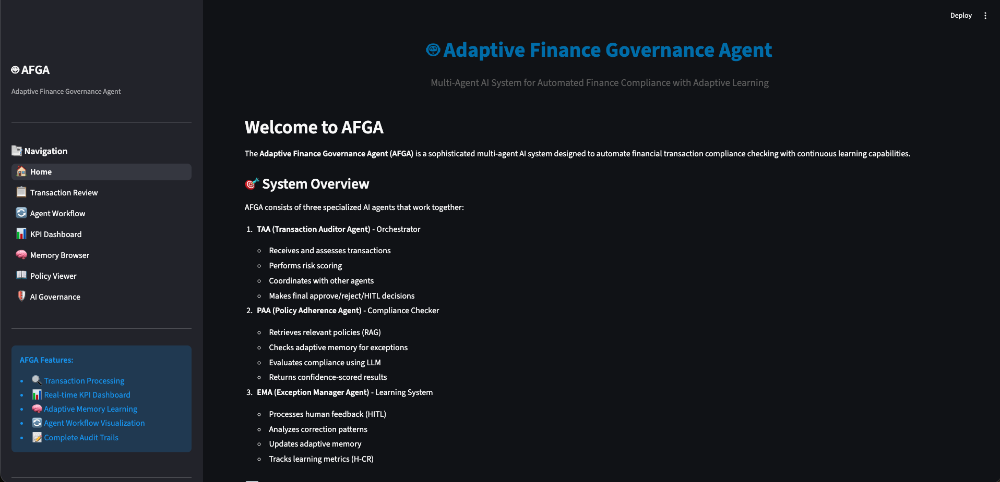 | 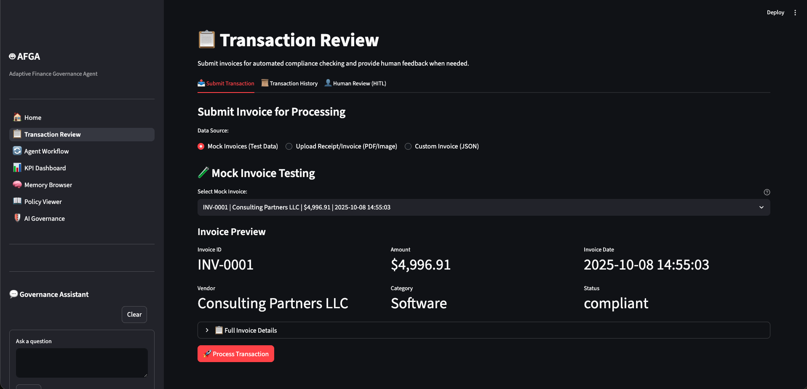 |

| Transaction Review | Agent Workflow |
|--------------------|----------------|
| 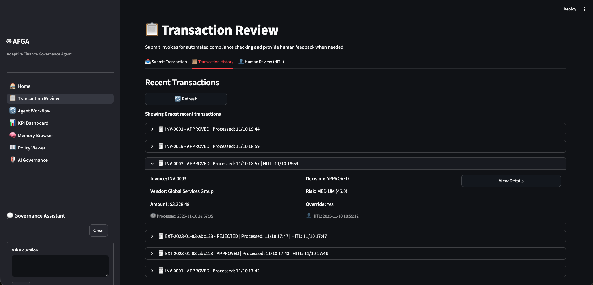 | 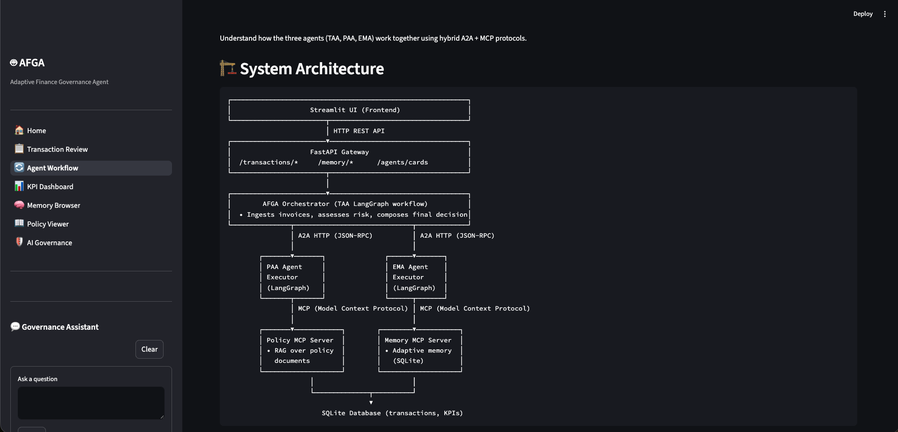 |

| KPI Dashboard | Memory Browser |
|---------------|----------------|
| 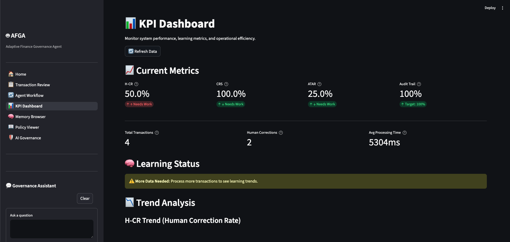 | 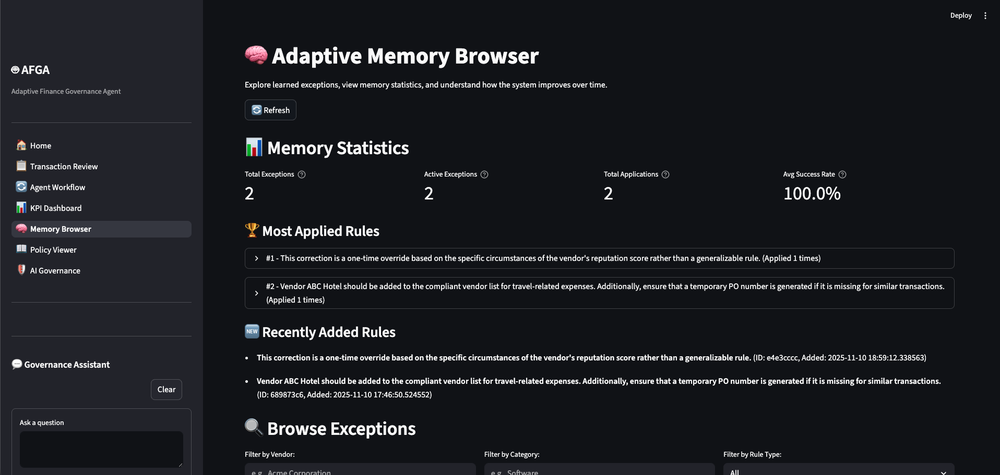 |

| Policy Viewer | AI Governance |
|---------------|---------------|
| 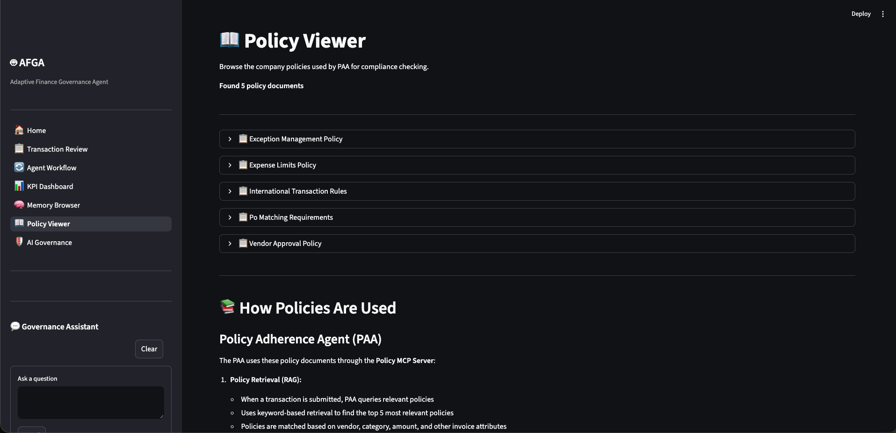 | 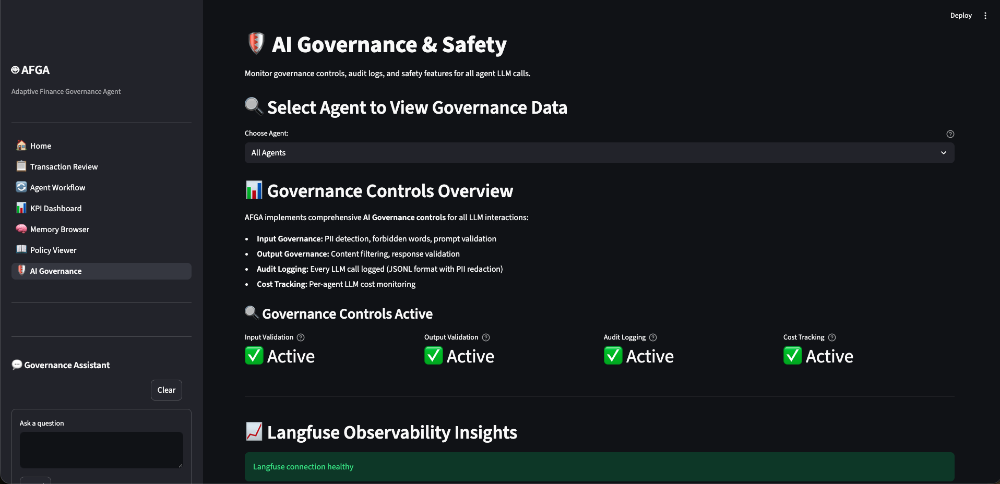 |
### AKS Deployment
| Frontend | Backend |
|----------|---------|
| 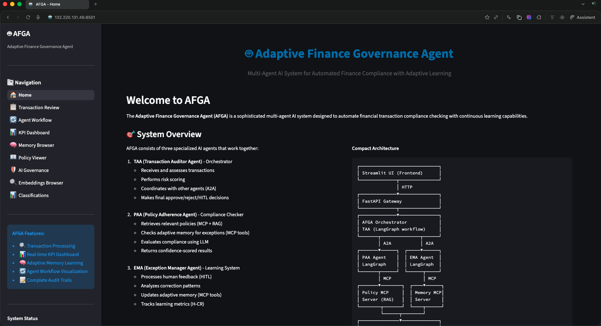 | 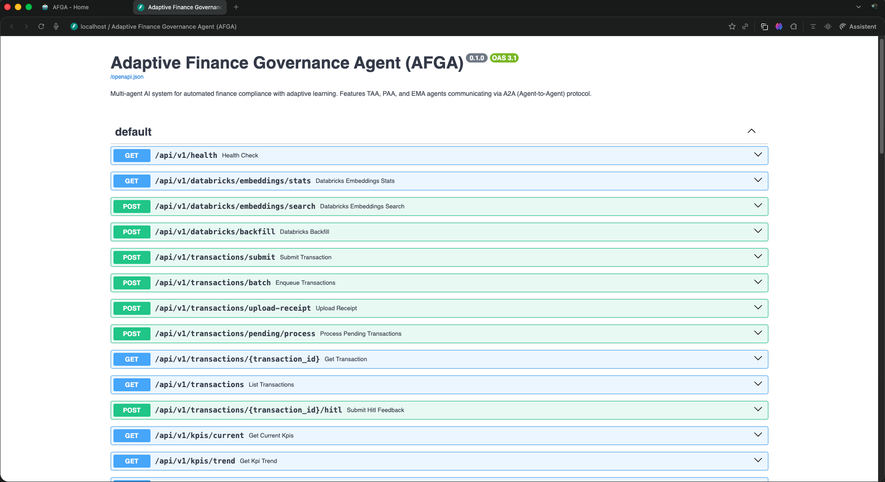 |

| Workloads | Pod Status |
|-----------|------------|
| 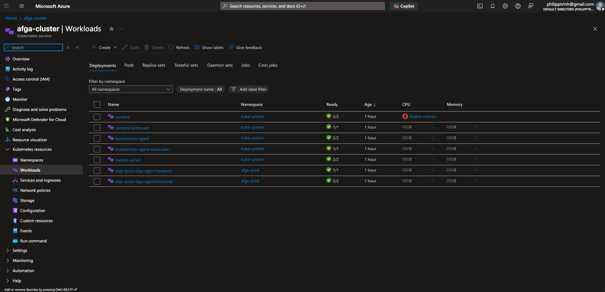 | 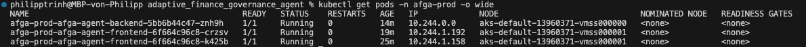 |

| ACR Repositories | Key Vault Secrets |
|------------------|-------------------|
| 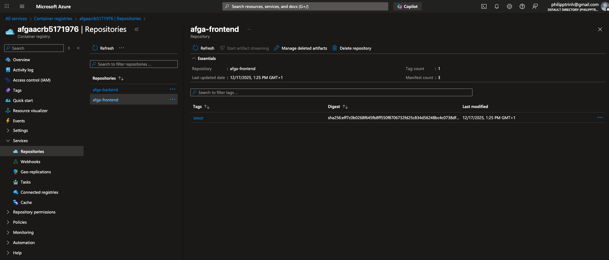 | 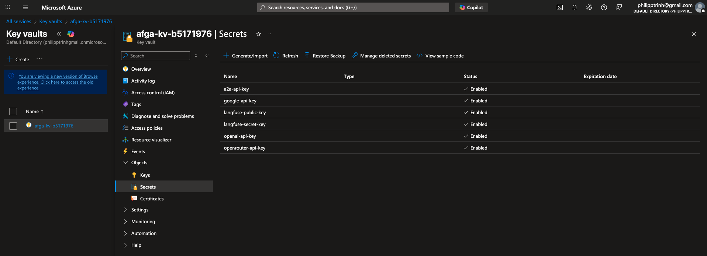 |

### Databricks Integration
| Pipeline | Bronze Table | Gold Table |
|----------|--------------|------------|
| 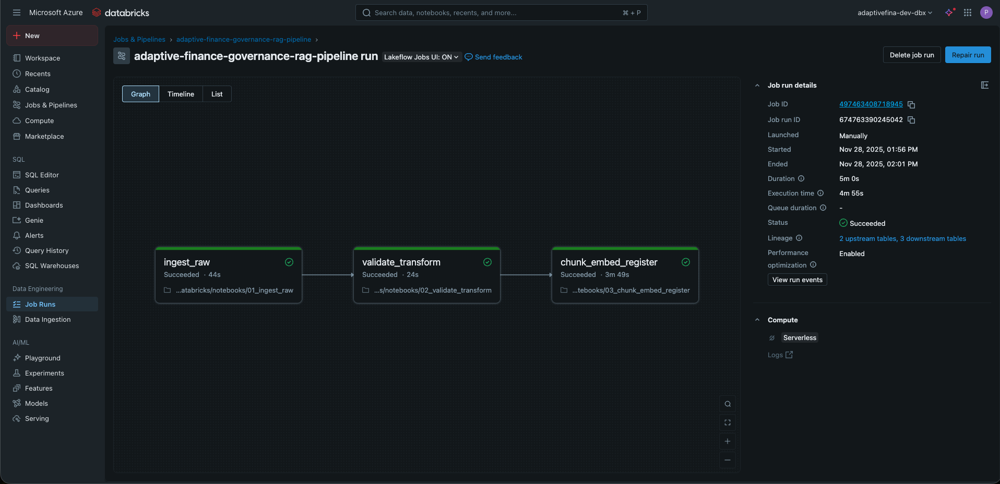 | 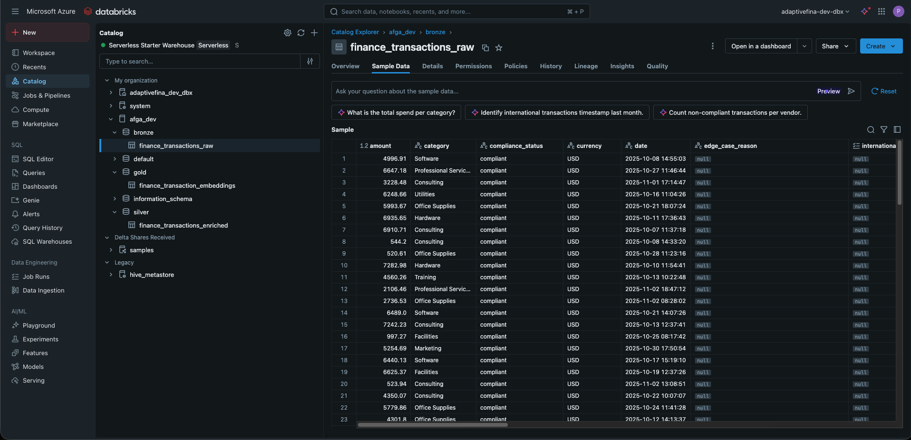 | 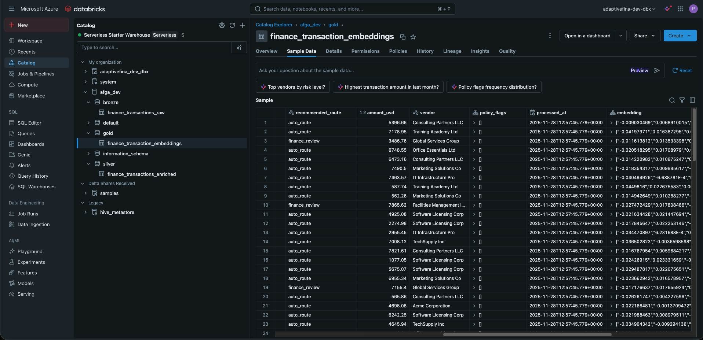 |

## 📦 Project Structure

```
adaptive_finance_governance_agent/
├── src/                          # Backend source code
│   ├── agents/                   # Multi-agent system
│   ├── api/                      # FastAPI routes
│   ├── db/                       # Database layer
│   └── services/                 # Business logic
├── streamlit_app/                # Frontend UI
│   ├── app.py                    # Main entry point
│   └── pages/                    # Multi-page app
├── deployment/                   # Deployment configs
│   ├── docker/                   # Docker setup
│   ├── kubernetes/               # K8s manifests
│   ├── terraform/                # Infrastructure as Code
│   └── helm/                     # Helm charts
├── scripts/                      # Utility scripts
├── data/                         # Local data storage
│   ├── mock_invoices/            # Test data
│   └── policies/                 # Compliance policies
├── docs/                         # Documentation
├── tests/                        # Test suite
├── .env                          # Environment config
├── start.sh                      # Quick start script
└── stop.sh                       # Stop script
```

## ☁️ Deployment

### 🏢 Choose Your Deployment Method

| Scenario | Best Option | Monthly Cost | Access Method |
|----------|-------------|--------------|---------------|
| **Development/Testing** | Local (`./start.sh`) | $0 | `http://localhost:8501` |
| **Small Team (5-20 users)** | Azure App Service | $50-100 | `https://afga.azurewebsites.net` |
| **Department (20-100 users)** | Azure App Service + VNet | $100-200 | Internal URL |
| **On-Premises** | Docker Compose on VM | Server cost | `https://afga.company.local` |
| **Enterprise (100+ users)** | AKS (Terraform + Helm) | $150-300 | Public/Private URL |

**📖 See [Deployment Options Guide](docs/DEPLOYMENT_OPTIONS.md) for detailed instructions on:**
- Azure App Service (easiest for internal apps)
- Azure Container Instances (simplest cloud option)
- Azure VM with Docker Compose
- On-Premises deployment
- AKS with Terraform + Helm (current setup)

**Quick Links:**
- [Terraform + Helm Guide](deployment/terraform/README.md) - Infrastructure as Code
- [Helm Deployment](deployment/helm/README.md) - Kubernetes deployment
- [Docker Deployment](deployment/docker/README.md) - Container setup

## 🔧 Configuration

Copy `.env.example` to `.env` and configure:

```bash
# Required: LLM API Keys
OPENROUTER_API_KEY=sk-or-v1-...
OPENAI_API_KEY=sk-proj-...

# Optional: Observability
LANGFUSE_PUBLIC_KEY=pk-lf-...
LANGFUSE_SECRET_KEY=sk-lf-...
LANGFUSE_HOST=https://cloud.langfuse.com

# Optional: Agent-to-Agent
A2A_ENABLED=true
A2A_BASE_URL=http://localhost:8000
```

## 📚 Documentation

- **[Quick Start Guide](./QUICKSTART.md)** - Get running in 5 minutes
- **[Project Structure](./PROJECT_STRUCTURE.md)** - Complete folder structure and file guide
- **[Classifications Guide](./docs/CLASSIFICATIONS_GUIDE.md)** - How to use classifications
- **[API Documentation](http://localhost:8000/docs)** - Interactive API docs
- **[Deployment Guide](./deployment/README.md)** - Docker, K8s, Helm options
- **[Architecture](./docs/ARCHITECTURE.md)** - System design and patterns
- **[Cleanup Summary](./CLEANUP_SUMMARY.md)** - What changed during reorganization

## 🐳 Deployment Options

### Docker
```bash
docker build -f deployment/docker/Dockerfile.backend -t afga-backend .
docker build -f deployment/docker/Dockerfile.frontend -t afga-frontend .
```

### Kubernetes
```bash
kubectl apply -f deployment/kubernetes/
```

### Helm (Production)
```bash
helm install afga deployment/helm/afga-agent \
  -f deployment/helm/overlays/prod/values.yaml
```

## 🧪 Testing

```bash
# Run all tests
pytest

# Generate mock invoices
python scripts/generate_mock_invoices.py --count 10

# Batch process invoices
python scripts/batch_process_invoices.py
```

## 💰 Cost Optimization

**Current Setup (Databricks Disabled):**
- Local SQLite database
- No cloud storage required
- LLM API costs only (~$10-50/month depending on usage)

**Optional Add-ons:**
- Azure Blob Storage: ~$2/month
- Databricks SQL Warehouse: ~$160/month (paused when disabled)
- AKS Cluster: ~$60-220/month

## 🔐 Security

- Environment variables for sensitive keys
- Azure Key Vault integration available
- RBAC for multi-user deployments
- Audit logging for all decisions

## 🤝 Contributing

1. Fork the repository
2. Create a feature branch
3. Make your changes
4. Run tests: `pytest`
5. Submit a pull request

## 📝 License

[License Type] - See LICENSE file for details

## 🆘 Support

- Issues: [GitHub Issues](link)
- Documentation: [Wiki](link)
- Email: support@example.com

## 🗺️ Roadmap

- [ ] Multi-tenant support
- [ ] Advanced analytics dashboard
- [ ] PDF invoice OCR integration
- [ ] REST API for third-party integration
- [ ] Role-based access control (RBAC)

---

**Built with:** Python 3.11+ • FastAPI • Streamlit • LangGraph • SQLite

